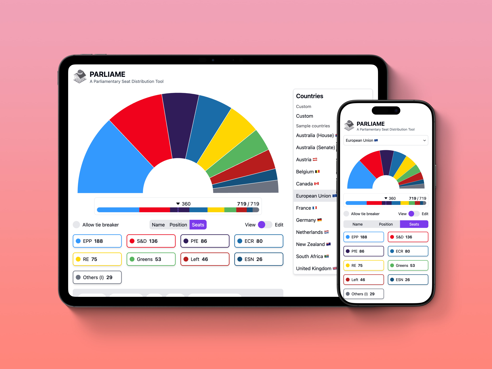

# 🏛️ Parliament Seats

[](https://parliame.com)

🌐 **Live Demo:** [https://parliame.com](https://parliame.com)

Parliament Seats is an interactive **coalition simulator and parliamentary seat visualizer** inspired by election-night graphics used in television broadcasts.

Many election visualizations show seat distributions for a single election. Parliament Seats generalizes that idea into a reusable tool where users can explore **different parliamentary systems, party configurations, and coalition scenarios** across multiple countries.

The application allows users to experiment with political party configurations and instantly see how seat distributions translate into potential governing coalitions.

---

# Why This Project Exists

Election broadcasts often include beautiful interactive graphics showing how seats are distributed in a parliament and which coalitions might form a government.

However, these tools are usually tied to **a specific election and dataset**.

Parliament Seats was created to make that experience reusable:

- explore different parliamentary systems
- test hypothetical election outcomes
- experiment with coalition combinations
- visualize how seat distributions affect governing majorities

---

# Features

## Coalition Simulation

Select political parties and instantly see whether they reach a governing majority.

Seat totals and majority thresholds update in real time as parties are selected.

---

## Tie-Breaker Logic

Supports parliamentary systems where a **tie-breaking vote** may determine the outcome (e.g. the US Senate model).

Tie-breaking is treated as a **vote outcome rule**, not as an additional seat.

---

## Multi-Country Support

Includes sample parliamentary structures such as:

- European Union
- Germany (Bundestag)
- Austria (Nationalrat)
- Netherlands (Tweede Kamer)
- Belgium (Kamer / Chambre)
- United Kingdom (House of Commons)
- South Africa (National Assembly)
- Australia (Senate and House)
- Canada (House of Commons / Chambre des communes)
- France (Assemblée nationale)
- New Zealand (House of Representatives)

Users can also create custom parliament configurations.

---

## Political Spectrum Visualization

Parties can be sorted and displayed according to their **political positioning** (left → center → right), allowing users to visualize ideological balance within coalitions.

---

## Interactive Seat Visualization

Seat distributions are displayed using:

- horizontal bar charts for seat counts
- pie charts for seat distribution
- majority threshold indicators

Visualizations update instantly when party data changes.

---

## Scenario Import / Export

Parliament configurations can be saved and shared using **JSON import/export**.

This allows users to:

- store custom scenarios
- recreate hypothetical elections
- share configurations with others

---

## Multilingual Interface

The application currently supports:

- English
- German (Deutsch)
- French (Français)
- Dutch (Nederlands)

Language can be changed using the `?lang=` URL parameter.

---

## Responsive Design

Parliament Seats works across desktop, tablet, and mobile devices.

The visualization layout adapts automatically to different screen sizes.

---

# Getting Started

## Prerequisites

- Node.js 20+
- npm or yarn

---

## Installation

Clone the repository:

```bash
git clone https://github.com/disfordave/parliament-seats.git
cd parliament-seats
```

Install dependencies:

```bash
npm install
```

Start the development server:

```bash
npm run dev
```

Open:

```
http://localhost:5173
```

---

# Available Scripts

| Command           | Description               |
| ----------------- | ------------------------- |
| `npm run dev`     | Start development server  |
| `npm run build`   | Build for production      |
| `npm run preview` | Preview production build  |
| `npm run lint`    | Run ESLint                |
| `npm run format`  | Format code with Prettier |
| `npm run test`    | Run tests using Vitest    |

---

# Built With

- **React** — UI framework
- **TypeScript** — static typing
- **Vite** — development server and build tool
- **Zustand** — state management
- **Tailwind CSS** — styling
- **Nivo** — data visualization
- **Motion** — UI animations
- **Vitest** — unit testing

---

# How It Works

1. Select a country or create a custom parliament
2. Add or modify political parties and seat counts
3. Adjust ideological positions or party metadata
4. Select parties to form potential coalitions
5. Instantly see whether a governing majority is reached

---

# Contributing

Contributions are welcome.

Possible areas for improvement include:

- additional parliamentary systems
- visualization improvements
- accessibility enhancements
- additional language support

To contribute:

```bash
git checkout -b feature/your-feature-name
git commit -m "Add feature"
git push origin feature/your-feature-name
```

Then open a pull request.

---

# License

This project is licensed under the **GNU Affero General Public License v3.0 or later (AGPL-3.0-or-later)**.

You are free to use and modify the project, but if you deploy it as a service, you must also share your modifications under the same license.

See the [LICENSE](LICENSE) file for details.
